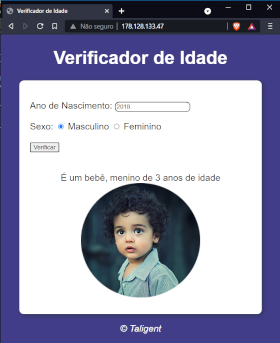
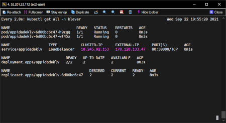
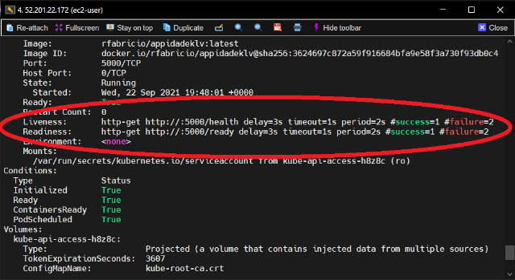
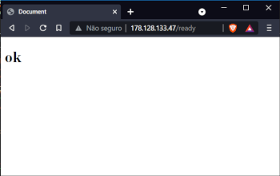

## Presentation of the project

### The objective this  project is implement a web application in a Kubernetes cluster with resources what grant security, stability and facility of monitoring. The subsequent lines describe how was implement each step of the solution proposed.


## What this document apresent
### The description of the Docker image, as well as the source code of the application, web pages and another components. Also includes Kubernetes manifests and Ansible playbooks.


## What the behavior expected of the application
### The application is a simple age calculator that show a representative image of the character. Is solicited a born year and the sex of the character. Clicked on button the age is calculated and the image is showed.



#### The main url is something like <http://address.xyz>. Though, other four variants exists. This variants change the behaviour or get status of the functioning of the application.

The url <http://address.xyz/health> return the disponibility of the application.

> This endpoint is consumed for livenessProbe resource of the Kubernetes

The url <http://address.xyz/ready> return the possibility of the application receive new requests.

> This endpoint is consumed for readinessProbe resource of the Kubernetes

The url <http://address.xyz/sethealth> make the app break.

> This force the Kubernetes kill the pod, putting another in your place.

The url <http://address.xyz/setunready/time_in_seconds/> make the app unavailable for new requests for x seconds. Simulating a high load environment.

> This instruct the Kubernetes withdraw the end point of the pod impaired until the load normalize.

## The Dockerfile

#### Dockerfile

```dockerfile
FROM  python:3
LABEL "vendor"="klv"
LABEL version="v1.1"
LABEL description="Aplicação de cálculo de idade com JavaScript e servidor python"
LABEL maintainer="rfabriciors@gmail.com"

RUN apt-get update -y && \
   apt-get install -y python python3-pip python-dev

RUN pip install Flask

WORKDIR /app

COPY . .

EXPOSE 5000

CMD [ "python", "./app.py"]
```

## The Kubernetes manifests

### The namespace creation

#### create-namespace.yaml

```yaml
apiVersion: v1
kind: Namespace
metadata:
name: klever
```

### The Kubernetes manifest to deploy stage of the application

#### deployment-appidadeklv.yaml

```yaml
apiVersion: apps/v1
kind: Deployment
metadata:
  namespace: klever
  labels:
    app: appidadeklv
  name: appidadeklv
spec:
  replicas: 2
  selector:
    matchLabels:
      app: appidadeklv
  template:
    metadata:
      labels:
        app: appidadeklv
    spec:
      containers:
      - image: rfabricio/appidadeklv:latest
        name: appidadeklv
        ports:
        - containerPort: 5000
        livenessProbe:
          httpGet:
            path: /health
            port: 5000
          initialDelaySeconds: 3
          periodSeconds: 2
          timeoutSeconds: 1
          successThreshold: 1
          failureThreshold: 2
        readinessProbe:
          httpGet:
            path: /ready
            port: 5000
          initialDelaySeconds: 3
          periodSeconds: 2
          timeoutSeconds: 1
          successThreshold: 1
          failureThreshold: 2          
        resources: {}
status: {}
```
### The Kubernetes service creation

#### service-appidadeklv.yaml

```yaml
apiVersion: v1
kind: Service
metadata:
  namespace: klever
  labels:
    app: appidadeklv
  name: appidadeklv
spec:
  ports:
  - port: 80
    protocol: TCP
    targetPort: 5000
    nodePort: 30000
  selector:
    app: appidadeklv
  type: LoadBalancer
status:
  loadBalancer: {}
```

## The show time

Considering that exists a Kubernetes cluster available and that the kubectl command is configured, deploying the application is simply executing the commands below:

```bash
kubectl apply -f create-namespace.yaml
kubectl apply -f deployment-appidadeklv.yaml
kubectl apply -f service-appidadeklv.yaml
```

The livenessProbe and readinessProbe can be verified through the pod description:

```bash
kubectl describe pod <pod_name>
```

## Automating with Ansible

After installing the Ansible in an environment that access the Kubernetes cluster through the kubectl command, must have install the following modules installed:

```bash
pip3 install kubernetes
pip3 install k8s
pip3 install openshift
ansible-galaxy collection install community.kubernetes

ansible-playbook teste.yaml -e 'ansible_python_interpreter=/usr/bin/python3'
```

#### Is recommended to put the python3 like default interpreter to Ansible /etc/ansible/ansible.cfg. To this, edit the file ansible.cfg

#### ansible.cfg

```file
[defaults]
interpreter_python=/usr/bin/python3
```

### The Ansible playbook file is basically the three manifests files of the Kubernetes in a single file with especifics instructions of the Ansible.

#### ansible_deploy.yaml

```yaml
---
- name: Execute deploy in Kubernetes Cluster
  hosts: local
  gather_facts: no
  tasks:
  - name: Create klever Namespace
    k8s:
      state: present
      definition:
        apiVersion: v1
        kind: Namespace
        metadata:
            name: klever
  - name: Create deployment in kubernetes cluster
    k8s:
      state: present
      definition:
        apiVersion: apps/v1
        kind: Deployment
        metadata:
          namespace: klever
          labels:
            app: appidadeklv
          name: appidadeklv
        spec:
          replicas: 2
          selector:
            matchLabels:
              app: appidadeklv
          template:
            metadata:
              labels:
                app: appidadeklv
            spec:
              containers:
              - image: rfabricio/appidadeklv:latest
                name: appidadeklv
                ports:
                - containerPort: 5000
                livenessProbe:
                  httpGet:
                    path: /health
                    port: 5000
                  initialDelaySeconds: 3
                  periodSeconds: 2
                  timeoutSeconds: 1
                  successThreshold: 1
                  failureThreshold: 2
                readinessProbe:
                  httpGet:
                    path: /ready
                    port: 5000
                  initialDelaySeconds: 3
                  periodSeconds: 2
                  timeoutSeconds: 1
                  successThreshold: 1
                  failureThreshold: 2          
                resources: {}
        status: {}
  - name: Create service in kubernetes cluster
    k8s:
      state: present
      definition:
        apiVersion: v1
        kind: Service
        metadata:
          namespace: klever
          labels:
            app: appidadeklv
          name: appidadeklv
        spec:
          ports:
          - port: 80
            protocol: TCP
            targetPort: 5000
            nodePort: 30000
          selector:
            app: appidadeklv
          type: LoadBalancer
        status:
          loadBalancer: {}
```

### Finally, run the Ansible playbook...

```bash
ansible-playbook ansible/ansible_deploy.yaml
```
## We admire...



> Active monitoring




